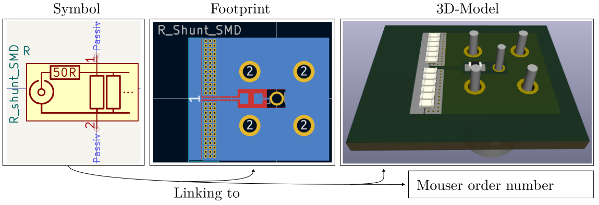

# Welcome to the LEA KiCad library

This repository contains a KiCad library for symbols, footprints and 3D-models including mouser material numbers to auto-generate BOMs (bill of materials) by using [KiCost](https://github.com/hildogjr/KiCost).

Features:
 * Reviewed symbols and footprints trough pull-requests,
 * all symbols are hard linked to a footprint, this avoids missmatching symbol and footprint,
 * symbol names follow a type code, for improved searchability,
 * symbols containing mouser material numbers to auto-generate a BOM using [KiCost](https://github.com/hildogjr/KiCost),
 * using KiCost together with this library can make requests to [mouser](https://eu.mouser.com/), to see if all PCB components are on stock.




# Install the library

## Set library file path
Add this library to your project. Make sure that you use **exactly** the same `Nicknames` as shown here:
 * `Preferences` -> `Manage Symbol Libraries` -> Project Specific Libraries: Nickname: `LEA_SymbolLibrary`, Library Path: `your/path/LEA_KiCad_Library/LEA_Symbol_Library/LEA_Symbol_Library.kicad_sym`
 * `Preferences` -> `Manage Footprint Libraries` -> Project Specific Libraries: Nickname: `LEA_FootprintLibrary`, Library Path: `your/path/LEA_KiCad_Library/LEA_Footprint_Library.pretty`

It is also possible to add both libraries to the `Global Libraries`.


## Set environment variable for 3D models:
In the KiCad main menu, first select `Preferences` and then `Configure Path`.
Replace the environment variable `MODEL_3D` with the current location of the 3D-models, e.g. `/path/LEA_KiCad_Library/LEA_3D_Models`. This should be the 3D-models for the `LEA_KiCad_Library` repository.

Note: if there is a variable `KICADx_3DMODEL_DIR`, ignore this variable and add `MODEL_3D` as mentioned above.


# Using the library

## Adding components
The main branch is protected. To add new components, open a new separate branch
```
git branch my-new-branch
```
Open KiCad, add your new symbols and footprints to the library. Each symbol should have the keys `Manufacturer`, `manf#` (manufacturer order number) and `mouser#` (mouser order number). Link the footprint and the 3D model. The 3D-model file path needs to be a relative path with the above mentioned environment variable. The 3D file path is e.g. `${MODEL_3D}/my3dmodel.stp`. Run `git status` to see your changed files. Add the example files `symbolfile` and `my3dmodel.stp` to the staging area and commit the changes. Afterwards, use `git push` to publish the changes to the new branch. 
```
git add symbolfile my3dmodel.stp
git commit -m "add new component xyz and 3D-model"
git push
```
Open the GitHub page, choose your branch and create a `pull request`.

## BOM generation
The component library is aligned to use the add-on [KiCost](https://github.com/hildogjr/KiCost). Therefore the above mentioned keys `Manufacturer`, `manf#` and `mouser#` are mandatory in the symbol. In the schematic, navigate `Tools` -> `create BOM` and run a random one, e.g. `bom_csv_grouped_by_value`. Install KiCost, navigate via terminal to your KiCad project folder and enter `kicost` to your terminal. As input file, choose the `.xml` file what was created by the BOM command. After that, the KiCost BOM will be created. To get the prices and stock information from Mouser, create a Mouser API key on the Mouser homepage and enter it into the [configuration file](https://hildogjr.github.io/KiCost/docs/_build/singlehtml/index.html#configuration-file). 

## Pin labels
### Connectors
 * All pins should be `passive` (no `power` or `bidirectional`, as the usage changes from schematic to schematic)
 

## Library type labels
For a better findability and sorting of the many components, it is necessary to use a type code. Some examples are given here.
### SMD resistors
Differences:
 * Type: `SMD` / `THT`
 * Values: `_100R` / `__4R7` / `0R001`
 * Size: `0603` / `0704` / `0403`
 * Technology: Thin film `_THIN` / Thick film `THICK`
 * `HINT`: e.g. `SHUNT`
 * Derivation in percent: `_1P` / `_5P` / `10P` / `20P`
 * Voltage: `75V` / `100V`

Examples:
 * `R_0805_100R__THIN_20P_150V`
 * `R_0603_100R__THIN__1P__75V`
 * `R_0403__4R7_THICK_10P__50V`


### THT resistors
 Differences:
 * Values: `_100R` / `__4R7` / `0R001`
 * Size: `0603` / `0704` / `0403`
 * Derivation: `_1P` / `_5P` / `10P` / `20P`
 * RM: `_RM5` / `RM10` / `RM12`
 * `HINT`: e.g. `SHUNT`

 Examples:
 * `R_THT_0704__RM5_10P____1k`
 * `R_THT_0704_RM10__1P_0R001_SHUNT`

### Capacitors
 * Type: `SMD` / `THT`
 * Values: `100u` / `4u7` / `10n`
 * Size: `0603` / `0704` / `0403`
 * Voltage: `25V` / `100V` / `600V`

Examples:
 * `C_SMD_0603_100V__1u0`
 * `C_SMD_0805__25V__10u`
 * `C_SMD_1206__16V__4u7`

### Diodes
 * Start with `D_`
 * Housing: `0603` / `0704` / `0403` / `SOD` / `DFN` / `SMB` / ...
 * Current capability: `1A0` / `0A125` / ...
 * last key: exact type, e.g. `B140HW-7` / `TS4448_RGG` / ...     

Examples:
 * `D_0603_0A125_TS4448_RGG`
 * `D_SOD_1A0_B140HW-7`

### Drivers
Hard to find general rules.
 * Channels: `Single`/ `Dual`    

Examples:
 * Driver_Dual_TI_value
 * Driver_Single_TI_value
 * Driver_Single_TI_value

### Microcontrollers
Examples:
 * `uC_FPGA_`
 
 
### Logic ICs


### Schmitt-trigger
Examples:
 * `ST_6CH_CMOS_SOIC14_MC74HC14ADG`


